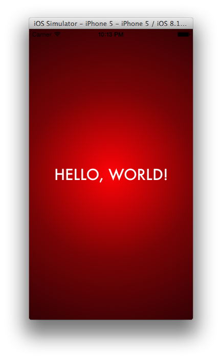
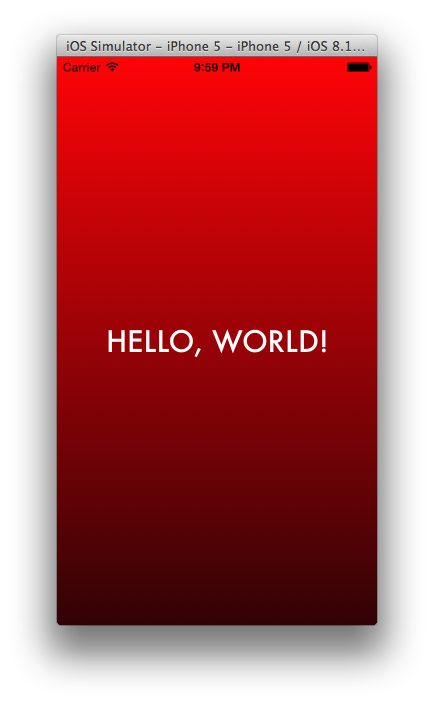

# PRGradientView
A simple solution for radial or linear gradient needs in iOS


## Why?
I wanted a simple lightweight library in Objective-C that satisfied radial gradient view needs, but couldn't find any...so I made one.


## Installation
Drag and drop PRGradientView.h and .m files into your project.


## Usage
First, be sure to ```import "PRGradientView.h"``` wherever you want to use it.

### Example Convenience Method Usage
```objc
- (void)viewDidLoad {
    [super viewDidLoad];

    //Have a simple red radial gradient as the main background for this view controller.
    //The convenience method creates a gradient view and adds it as a subview to self.view, then sends it to the back.
    NSArray *colors = @[
        [UIColor colorWithRed:(255.0/255.0) green:(3.0/255.0) blue:(7.0/255.0) alpha:1.0],
        [UIColor colorWithRed:(120.0/255.0) green:(3.0/255.0) blue:(5.0/255.0) alpha:1.0],
        [UIColor colorWithRed:(50.0/255.0) green:(2.0/255.0) blue:(5.0/255.0) alpha:1.0]
    ];

    [PRGradientView addGradientViewAsBackgroundToView:self.view withType:PRGradientTypeRadial usingColors:colors];
}
```



### Example Usage Not Using Convenience Method
```objc
//create a simple red linear gradient view
NSArray *colors = @[
    [UIColor colorWithRed:(255.0/255.0) green:(3.0/255.0) blue:(7.0/255.0) alpha:1.0],
    [UIColor colorWithRed:(50.0/255.0) green:(2.0/255.0) blue:(5.0/255.0) alpha:1.0]
];

PRGradientView *gradientView = [[PRGradientView alloc] initWithRadialGradientViewUsingColors:colors withFrame:self.view.frame];

//now do whatever you want with the view, such as adding it as a subview somewhere
...
```




## TODO
* Be able specify from and to points, so you can for example, not just only have vertical linear gradients
* Have convenience methods for linear gradients, such as left-to-right (makes use of method mentioned above with preset points)
* ???
